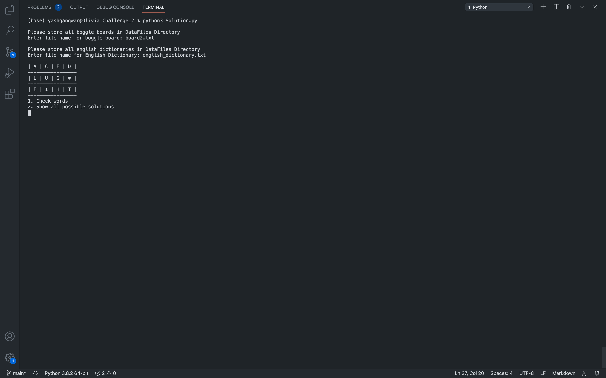
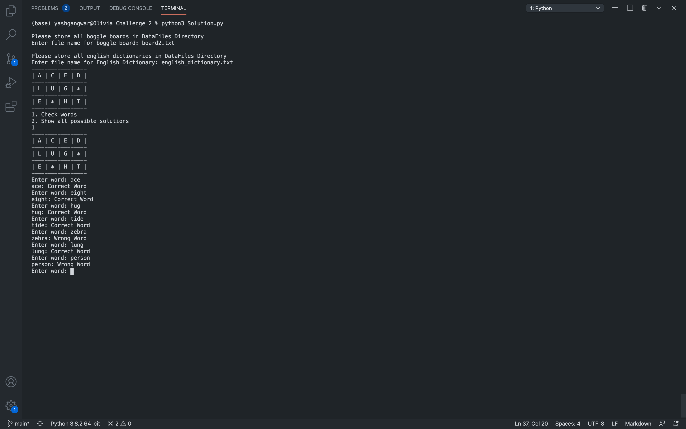
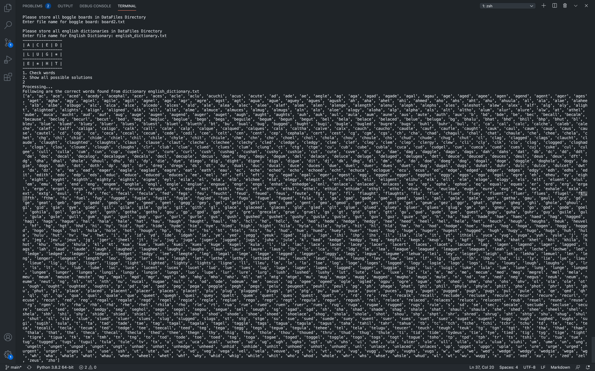

# Twitter Boggle Challenge
Boggle is a word game that is played on a 4x4 board with 16 letter tiles. I've implemented the Challenge #2 (more backend).
The program consists of 2 functions named findWord and findAll.

## Installation
The only library required is numpy. Install numpy using

```bash
pip install numpy
```

## Usage
- The solution script is stored in 'Challenge_2' directory.
- All the datafile including boggle boards and english dictionary need to be stored in DataFiles directory.
- Boggle board file to be passed need to be a text file (.txt) with commas separating the letters.
- English Dictionary should be a text file (.txt) one word per line.

To run the script

```bash
pip install -r requirements.txt
cd Challenge_2
python3 Solution.py
```

Enter file name for board and dictionary when prompted (along with extension .txt)

Function 1 for validating whether given word is part of dictionary and can be found on boggle board can be tested by entering 1, to 'Check Words' when prompted.

Function 2 for returning all the possible words found in the board can be tested by enterning 2, to 'Show all possible solutions' when prompted.

## Screenshots



